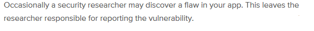

[Home](./README.md)
[Week 1](./week1.md)
[Week 2](./week2.md)
[Group Reflection](./group_reflection.md)

### 11/02/2019 Reflection

Link to Natas Writeups: https://hackmd.io/s/ByI4tVA4V

### Homework for Wednesday

Ethical hacking and bug bounties are impacting stakeholders as they allow people who have these hacking skills and people who hunt through bugs, go through their system and find vulnerabilities. Businesses that go through these bug bounty programs looking for people to attack their web application, with the intent to find any bugs and vulnerabilities. As stated in the bug crowd responsible disclose.

The security researcher must report the vulnerability, and disclose the company privately, with detailed response on how they found the vulnerability, and how to fix the problem. This will benefit the stakeholder a lot as if their system does get targeted in the future, they don't get any sensitive data leaked. It is also better that they get exploited my security researchers who are doing their job, and wanting to better strengthen the web application. Then by a hacker exploiting the vulnerabilities and using that information for bad.

An example that could be used is the SQL injection on the Juice Shop last week. If a hacker finds this out and exploits the SQL database and gains admin access, he can then jump on and try to own the whole server, and get a lot of sensitive information about clients, credit card numbers etc. But if a security research finds this exploit and discloses it to the company and patch it. It will greatly help the web application. 

Ethical Hacking and bug bounties are greatly needed to help strengthen stakeholders to better their web app security to fix their mistakes so hackers can’t exploit them!

https://www.bugcrowd.com/resource/what-is-responsible-disclosure/

https://www.hackerone.com/disclosure-guidelines

https://www.cybrary.it/2018/03/ethical-hacking-necessary/

