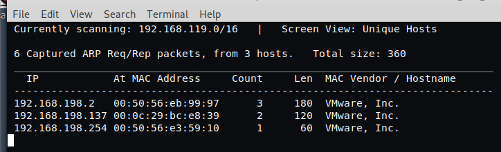
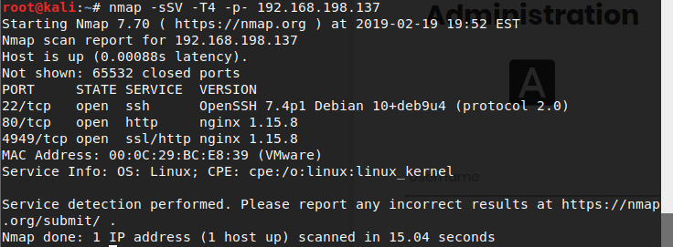
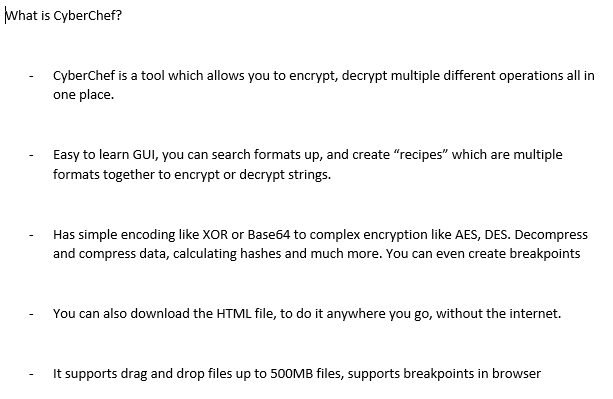

#Week 3

[Home](./README.md)
[Week 1](./week1.md)
[Week 2](./week2.md)
[Week 2](./week3.md)
[Group Reflection](./group_reflection.md)

### Monday 18/02/2019
Today we done our free for all to try and get to know more people, and discussing what our goals were for the week. As talking to Oliver, we had similar ideas on what our goals was, and where we were up to. Oliver was doing the natas challanges and bandit levels. I was doing the same thing and we were on the same challanges. We talked on how we solved our challanges, it was assuring that I was talkign to someone who was on the same page and learning experince as I was. 

Oliver's goals for this week was to understand how to gain shell access on his box, and to get better at google searches. As he found that he also tends to not search for the right thing and finding the wrong information. My goals for this week was to get up to the goal on natas and bandit. Learn more about privilege escalation, how it works and some ways to do it, and get a box. 

After this, we watched Darsh doing a workshop on how to go from boot2root. While watching Darsh, I was figuring out what box to do and try to replicate it. I ended up starting the box called "Mr-Robot", a boot2root based on the TV-Series. This was my deliverable. I wanted to crack the box by the end of the week, and explain how I did it!

Today we also went into groups to work on our presentation for Wednesday. We kept the same group as our first week presentaion but we added 2 new group members, Jason and Andre. These guys I have worked previsouly as we competed together as a team in CysCa.

We had to make a presentaion on a tool that we researched, showing the capabilities of the tool and what it is used for and how it is used, and a demo on how it is used. We all decided to use the tools Wireshark (packet sniffing) and CyberChef (cryptographic functions). Both of these tools can be used in conjunction with each other to find passwords that has been encrypted (an example).

### Tuesday 19/02/2019

Tuesday, Jason and I decided to come to uni early to start working on our presentaions and figure out our parts and send messages to the group, directing them on what they can do, and provide help to them. After this I started working on the box, "Mr-Robot". I got the first key which I am happy about. Wasn't that difficult due to the help of the Natas challanges from last week. 

Later, we went to SecTalks at Barangaroo, in the PWC office. Edward Farrel. He talked about zigbee packets and the 802.15.4 protocol, and what it does. He then goes on to his examples where he made a little machine to track zigbee packets. He explains the frequency he needs and where the packets are coming through. This got me intrested in hardware hacking and how wireless protocols work. I went up to Edward, and asked him some questions on how to get into hardware hacking  and understanding the protocol he was on and branch off doing my own research. He gave me his RTL-SDR. And told me to learn how this works and play around with it. This gives me more of an incentive to learn more about hardware hacking hacking and wireless protocols and try and conduct my own research on what I can do! Edward later connected me to LinkedIn.

### Wednesday 20/02/2019

Today the Deloitte pentesters came to give us a talk about what they do as their job. And some stories in the field. We later do a CTF they brought in. I learnt some ways to discover ports and IP address on the netowrk, like netdiscover and nmap. 

Netdiscover discovers the IP address on the server you are on. This is good to enumerate to other machines, to continue trying to get root. 

Nmap is used to find the ports that the IP address is on. One thing about nmap that i learnt is that it makes alot of noise. This means that if blue teamers are watching you can be caught. This is way nmap has a stealth option to create less noise when scanning for ports.

We also done our presentation today, with the preperation on Tuesday with Jason, and the group though chats on teams. I felt very comfortable talking about my part and what I learnt about CyberChef. My part was focused on what is cyberchef. The below picture talks about what the points I talked about for my presentaion.

I also was working on my box, Mr Robot. I ended up getting root to Mr Robot. This is my first box I have ever completeed. All my thoughts, my challanges and the writeup itself will be in the deliverable link.
